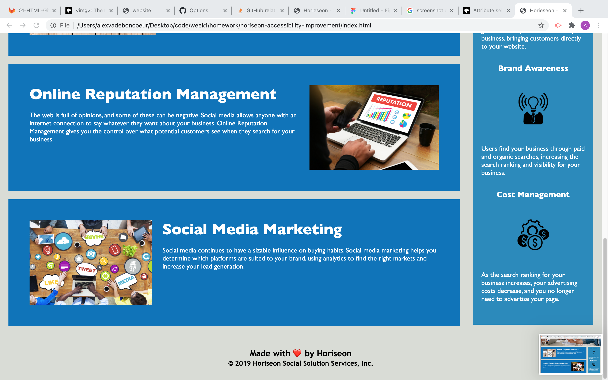

# horiseon_accessibility_improvements
Accessibility improvements to Horiseon home site.

## Goal
    
  Our goal was to modify the Horiseon home site to make it more accessable for search engine and assistive technology optimization.

## Link
 https://alexva397.github.io/horiseon-accessibility-improvement/

## Implementation
   
* We modified the html document to follow a semantic structure, creating clear divsions within the body using the correct html elements.
* We consolidated our style.css file. Combining elements with the same attributes and creating classes for them. These      classes were then tagged in the corresponding element in the index.html file.
* We arranges the elements within our style.css to match the flow of our index.html.
* We adding alt attributes to our images, giving an alternative if the image fails to load, and for assistive technology.
* We conedited the links within the nav element to ensure are working properly and linking to the correct element within the home screen.

## Screenshots

